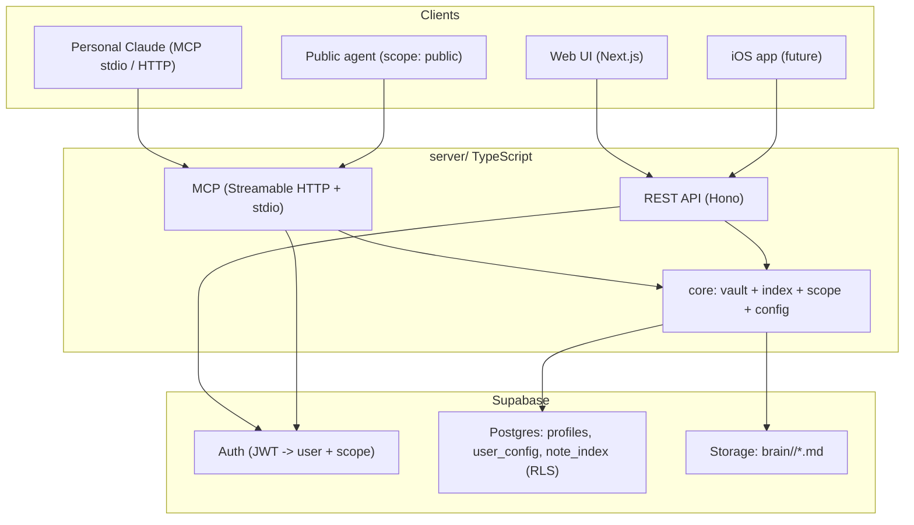

# ohmyself!

> Your second brain as loose markdown — exposed over MCP and a REST API, with privacy built in.

`ohmyself!` holds everything about a person (who they are, goals, projects, people,
journal, finances, secrets) as plain `.md` files (Obsidian style), **not** a typical
database. Those files are the source of truth; everything else is built on top:

- an **MCP server** so agents (your personal Claude, a public website agent) can
  search, read, and write your brain;
- a **REST API** for the web UI and a future iOS app;
- a **web UI** (light mode) to browse the brain and chat with an agent over it.

Privacy is per-note (`public` / `private` / `secret`). A public agent on
`juandisanchez.com` can answer about you using only public notes, while your personal
Claude (authenticated) can see everything. Multi-tenant from day one.



## Repo layout

```
server/      TypeScript: core lib + MCP server + REST API + connectors
web/         Next.js web UI (light mode; built with the `impeccable` design skill)
supabase/    config.toml + versioned migrations (tables, RLS, storage bucket)
templates/   default brain taxonomy + seed notes (used for onboarding new users)
```

## Prerequisites

- Node 20+ and pnpm (`corepack enable && corepack prepare pnpm@9.15.9 --activate`)
- A Supabase project (the migrations under `supabase/migrations/` define the schema)
- `gh` and `supabase` CLIs if you want to reproduce provisioning

## Setup

```bash
pnpm install
cp .env.example .env.local        # fill with your Supabase values — never commit it
cp .env.example web/.env.local    # only the NEXT_PUBLIC_* values matter for web
```

`.env.local` (server) needs at least:

```
SUPABASE_URL=...                  # https://<ref>.supabase.co
SUPABASE_ANON_KEY=...
SUPABASE_SERVICE_ROLE=...         # server-only, never in the browser
PUBLIC_AGENT_TOKEN=<random>       # token the public website agent presents
PUBLIC_AGENT_USER_ID=<your uuid>  # set after you sign up (see below)
```

Apply the database schema (already done if you provisioned with the CLI):

```bash
supabase link --project-ref <ref>
supabase db push
```

## Run locally

```bash
pnpm dev:server   # http://localhost:8787  — REST at /v1/*, MCP at POST /mcp
pnpm dev:web      # http://localhost:3000  — sign up, get a seeded brain, browse + chat
```

Create an account in the web UI; on first login your brain is seeded from
`templates/brain` automatically (idempotent). To point the **public agent** at your
brain, copy your user id (`/v1/me` returns it) into `PUBLIC_AGENT_USER_ID`.

Seed any user manually:

```bash
pnpm seed --user <userId>
```

## Connect your personal Claude (MCP)

### Local, over stdio
Add to your Claude Desktop / MCP client config. Use `VAULT_BACKEND=supabase` with your
real user id, or `VAULT_BACKEND=fs` for a purely local markdown folder.

```json
{
  "mcpServers": {
    "ohmyself": {
      "command": "pnpm",
      "args": ["--filter", "@ohmyself/server", "mcp"],
      "env": {
        "VAULT_BACKEND": "supabase",
        "OHMYSELF_USER_ID": "<your-supabase-user-id>",
        "OHMYSELF_SCOPE": "secret",
        "SUPABASE_URL": "https://<ref>.supabase.co",
        "SUPABASE_SERVICE_ROLE": "<service-role-key>",
        "BRAIN_BUCKET": "brain"
      }
    }
  }
}
```

Tools include personal-brain reads/writes plus company-space routing. Company reads use
`list_spaces`, `recall_space`, `search_space`, `list_space_notes`, and
`read_space_note`. Company owners/admins can write without changing the connection's
default tenant via `create_space_note`, `update_space_note`, `append_space_note`,
`link_space_notes`, and `save_space_skill`.

### Remote, over Streamable HTTP
Point an MCP client at `POST https://<your-host>/mcp` with an `Authorization: Bearer
<supabase-jwt>` header. Add `X-Brain-Scope: private` to keep `secret` notes out of a
given connection. The public website agent uses `Authorization: Bearer
<PUBLIC_AGENT_TOKEN>` and only ever sees public notes.

### Official connector (OAuth 2.1)
ohmyself! ships a self-hosted OAuth 2.1 authorization server so it can be added as a
one-click connector in Claude and ChatGPT — no manual token. It implements the MCP auth
spec: a `401` with `WWW-Authenticate` on `/mcp`, Protected Resource Metadata
(`/.well-known/oauth-protected-resource`, RFC 9728), Authorization Server Metadata
(`/.well-known/oauth-authorization-server`, RFC 8414), Dynamic Client Registration
(`/oauth/register`, RFC 7591), Authorization Code + PKCE (S256) via the web consent page
at `/authorize`, and a token endpoint (`/oauth/token`) with refresh-token rotation.

- Access tokens are opaque (`oma_…`, stored only as SHA-256 hashes) and resolve to the
  consented scope; refresh tokens are `omr_…`. Tables: `oauth_clients`,
  `oauth_auth_codes`, `oauth_tokens` (service-role only).
- Single-domain prod: the web project rewrites `/mcp`, `/oauth/*`, and `/.well-known/*`
  to the API project so everything lives under one origin (e.g. `https://www.ohmyself.ai`).
  Set `OMS_ISSUER`, `PUBLIC_API_URL`, and `PUBLIC_WEB_URL` accordingly on both projects.
- Connect: in Claude, Settings → Connectors → add the `/mcp` URL; in ChatGPT, Settings →
  Connectors → Create. You sign in, pick a scope (public/private/secret), and approve.

## Privacy model

Each note's frontmatter has `visibility: public | private | secret`. A request carries
a **scope**; it can read everything at or below its level (`public ⊂ private ⊂
secret`). Reads above scope return 404 (existence is hidden). Writes require a non-public
scope. See `templates/CONVENTIONS.md`.

## Per-user structure (config-driven)

The taxonomy (folders, note types, default visibilities) is **per user**, stored in
`user_config` and editable via `GET/PUT /v1/config`. Defaults live in
`templates/default-config.json` / `server/src/core/config.ts`. New notes are validated
against the user's config, not a global schema.

## Add a connector

Connectors ingest data into (and optionally out of) the brain. Implement the
`Connector` interface (`server/src/connectors/types.ts`) and register it in
`server/src/connectors/index.ts`. Run one via `POST /v1/connectors/:id/pull`. A
**Google Calendar → transcripts** connector ships in `server/src/connectors/`.

## Secrets / open source

This repo is public. Real keys live only in `.env.local` (gitignored) and your host's
env vars. Only `.env.example` (placeholders) is committed. The browser uses the anon
key only; the service role key is server-side.

## Deploy

> Full topology, runbook, and the "why" behind it live in
> [`docs/DEPLOYMENT.md`](docs/DEPLOYMENT.md) — **read it before deploying server/MCP
> changes.** Short version below.

**`www.ohmyself.ai` is the single public origin for all clients** (web, iOS,
agents, OAuth). It is a Vercel `web` (Next.js) project that **proxies** `/mcp`,
`/v1/*`, `/oauth/*`, `/connectors/*`, and `/.well-known/*` to the real backend on
**Railway** (`ohmyself-api-production.up.railway.app`), which runs the `server/`
code (REST + MCP + OAuth + crons).

Deploy server changes to Railway (this is the backend behind `www` that every MCP
client hits):

```bash
git push origin main
cd server && railway up --service ohmyself-api
```

There used to be a second, legacy copy of the server on Vercel
(`ohmyself-api.vercel.app`); it was **decommissioned on 2026-07-11**. There is now
exactly one backend (Railway), and every client and the `juandisanchez/` site go
through `www`. Don't recreate the Vercel server copy — see `docs/DEPLOYMENT.md`.

### Vercel layout

- **`server/`** → a Vercel project serving REST + MCP. The build runs `tsc` to `dist/`, and
  `api/index.js` (a serverless function) reuses the same request dispatcher as the local
  Node server (`src/http.ts`). All routes are rewritten to that function via `vercel.json`.
  The default brain is embedded (`src/templates.generated.ts`) so onboarding works without
  filesystem access. Set these env vars on the project: `SUPABASE_URL`,
  `SUPABASE_SERVICE_ROLE`, `SUPABASE_ANON_KEY`, `BRAIN_BUCKET`, `VAULT_BACKEND=supabase`
  (and optionally `PUBLIC_AGENT_TOKEN` / `PUBLIC_AGENT_USER_ID` for the public agent).
  For the OAuth connector also set `OMS_ISSUER`, `PUBLIC_API_URL`, and `PUBLIC_WEB_URL`
  (in single-domain setups all = your web origin, e.g. `https://www.ohmyself.ai`).
- **`web/`** → a Next.js Vercel project. Set `NEXT_PUBLIC_SUPABASE_URL`,
  `NEXT_PUBLIC_SUPABASE_ANON_KEY`, and `NEXT_PUBLIC_API_URL` (in single-domain prod this is
  your own web origin, since `/mcp` + `/oauth/*` are rewritten to the API project).

Deploy:

```bash
# server (the backend behind www.ohmyself.ai) → Railway
cd server && railway up --service ohmyself-api

# web frontend → Vercel
cd ../web && vercel deploy --prod
```

The server is a single Node HTTP process (REST + MCP) and runs on **Railway** in
production. It can run on any Node host (Fly.io / Render) with the env vars above.
A serverless copy can also run on Vercel (`server/vercel.json`), but that copy is
legacy — see [`docs/DEPLOYMENT.md`](docs/DEPLOYMENT.md).

> If a Vercel build hits pnpm's `ERR_INVALID_THIS` on the build image, the configs here
> force `npm install` for the standalone packages, which sidesteps it.

## License

MIT — see [LICENSE](LICENSE).
