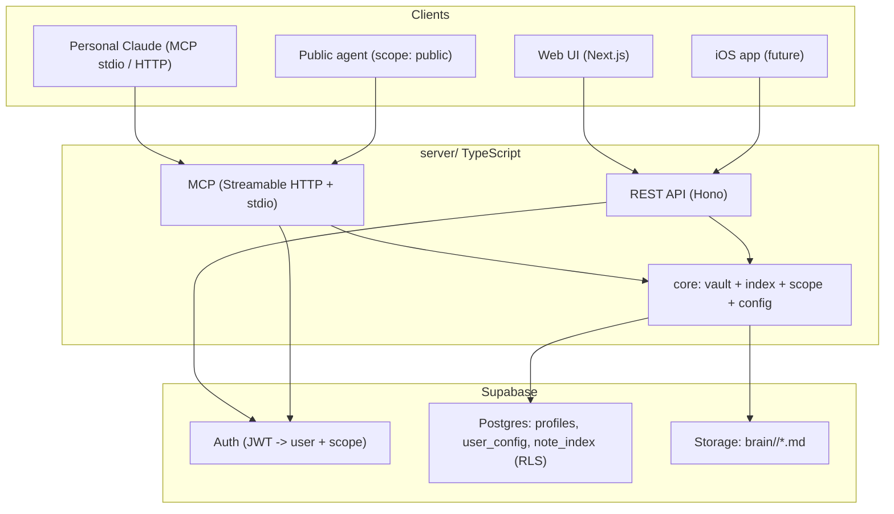

# ohmyself!

> Your second brain as loose markdown — exposed over MCP and a REST API, with privacy built in.

`ohmyself!` holds everything about a person (who they are, goals, projects, people,
journal, finances, secrets) as plain `.md` files (Obsidian style), **not** a typical
database. Those files are the source of truth; everything else is built on top:

- an **MCP server** so agents (your personal Claude, a public website agent) can
  search, read, and write your brain;
- a **REST API** for the web UI and a future iOS app;
- a **web UI** (light mode) to browse the brain and chat with an agent over it.

Privacy is per-note (`public` / `private` / `secret`). A public agent on
`juandisanchez.com` can answer about you using only public notes, while your personal
Claude (authenticated) can see everything. Multi-tenant from day one.



## Repo layout

```
server/      TypeScript: core lib + MCP server + REST API + connectors
web/         Next.js web UI (light mode; built with the `impeccable` design skill)
supabase/    config.toml + versioned migrations (tables, RLS, storage bucket)
templates/   default brain taxonomy + seed notes (used for onboarding new users)
```

## Prerequisites

- Node 20+ and pnpm (`corepack enable && corepack prepare pnpm@9.15.9 --activate`)
- A Supabase project (the migrations under `supabase/migrations/` define the schema)
- `gh` and `supabase` CLIs if you want to reproduce provisioning

## Setup

```bash
pnpm install
cp .env.example .env.local        # fill with your Supabase values — never commit it
cp .env.example web/.env.local    # only the NEXT_PUBLIC_* values matter for web
```

`.env.local` (server) needs at least:

```
SUPABASE_URL=...                  # https://<ref>.supabase.co
SUPABASE_ANON_KEY=...
SUPABASE_SERVICE_ROLE=...         # server-only, never in the browser
PUBLIC_AGENT_TOKEN=<random>       # token the public website agent presents
PUBLIC_AGENT_USER_ID=<your uuid>  # set after you sign up (see below)
```

Apply the database schema (already done if you provisioned with the CLI):

```bash
supabase link --project-ref <ref>
supabase db push
```

## Run locally

```bash
pnpm dev:server   # http://localhost:8787  — REST at /v1/*, MCP at POST /mcp
pnpm dev:web      # http://localhost:3000  — sign up, get a seeded brain, browse + chat
```

Create an account in the web UI; on first login your brain is seeded from
`templates/brain` automatically (idempotent). To point the **public agent** at your
brain, copy your user id (`/v1/me` returns it) into `PUBLIC_AGENT_USER_ID`.

Seed any user manually:

```bash
pnpm seed --user <userId>
```

## Connect your personal Claude (MCP)

### Local, over stdio
Add to your Claude Desktop / MCP client config. Use `VAULT_BACKEND=supabase` with your
real user id, or `VAULT_BACKEND=fs` for a purely local markdown folder.

```json
{
  "mcpServers": {
    "ohmyself": {
      "command": "pnpm",
      "args": ["--filter", "@ohmyself/server", "mcp"],
      "env": {
        "VAULT_BACKEND": "supabase",
        "OHMYSELF_USER_ID": "<your-supabase-user-id>",
        "OHMYSELF_SCOPE": "secret",
        "SUPABASE_URL": "https://<ref>.supabase.co",
        "SUPABASE_SERVICE_ROLE": "<service-role-key>",
        "BRAIN_BUCKET": "brain"
      }
    }
  }
}
```

Tools exposed: `search_brain`, `list_notes`, `read_note`, `create_note`,
`update_note`, `append_to_note`, `link_notes`, `get_context`.

### Remote, over Streamable HTTP
Point an MCP client at `POST https://<your-host>/mcp` with an `Authorization: Bearer
<supabase-jwt>` header. Add `X-Brain-Scope: private` to keep `secret` notes out of a
given connection. The public website agent uses `Authorization: Bearer
<PUBLIC_AGENT_TOKEN>` and only ever sees public notes.

## Privacy model

Each note's frontmatter has `visibility: public | private | secret`. A request carries
a **scope**; it can read everything at or below its level (`public ⊂ private ⊂
secret`). Reads above scope return 404 (existence is hidden). Writes require a non-public
scope. See `templates/CONVENTIONS.md`.

## Per-user structure (config-driven)

The taxonomy (folders, note types, default visibilities) is **per user**, stored in
`user_config` and editable via `GET/PUT /v1/config`. Defaults live in
`templates/default-config.json` / `server/src/core/config.ts`. New notes are validated
against the user's config, not a global schema.

## Add a connector

Connectors ingest data into (and optionally out of) the brain. Implement the
`Connector` interface (`server/src/connectors/types.ts`) and register it in
`server/src/connectors/index.ts`. Run one via `POST /v1/connectors/:id/pull`. A
**Google Calendar → transcripts** connector ships in `server/src/connectors/`.

## Secrets / open source

This repo is public. Real keys live only in `.env.local` (gitignored) and your host's
env vars. Only `.env.example` (placeholders) is committed. The browser uses the anon
key only; the service role key is server-side.

## Deploy

The server is a single Node HTTP process (REST + MCP). Deploy `server/` to any Node host
(Fly.io / Railway / Render) with the env vars above; deploy `web/` to Vercel. Both talk
to the same Supabase project, so the brain is reachable from web, iOS, and your agents.

## License

MIT — see [LICENSE](LICENSE).
