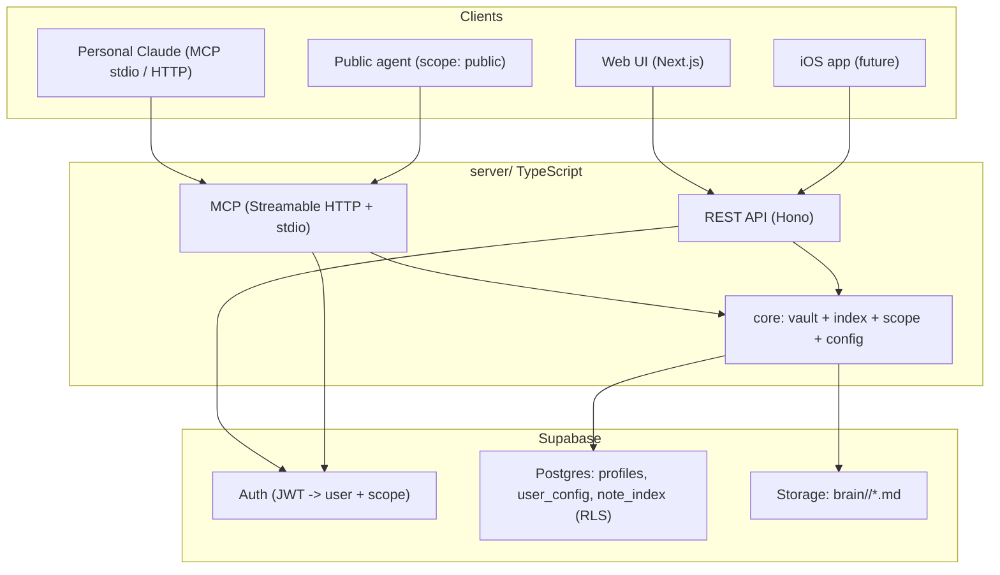

# ohmyself!

> Your second brain as loose markdown — exposed over MCP and a REST API, with privacy built in.

`ohmyself!` holds everything about a person (who they are, goals, projects, people,
journal, finances, secrets) as plain `.md` files (Obsidian style), **not** a typical
database. Those files are the source of truth; everything else is built on top:

- an **MCP server** so agents (your personal Claude, a public website agent) can
  search, read, and write your brain;
- a **REST API** for the web UI and a future iOS app;
- a **web UI** (light mode) to browse the brain and chat with an agent over it.

Privacy is per-note (`public` / `private` / `secret`). A public agent on
`juandisanchez.com` can answer about you using only public notes, while your personal
Claude (authenticated) can see everything. Multi-tenant from day one.


```mermaid
flowchart TD
  subgraph clients [Clients]
    Claude["Personal Claude (MCP stdio / HTTP)"]
    Web["Web UI (Next.js)"]
    Public["Public agent (scope: public)"]
    iOS["iOS app (future)"]
  end
  subgraph server [server/ TypeScript]
    MCP["MCP (Streamable HTTP + stdio)"]
    API["REST API (Hono)"]
    Core["core: vault + index + scope + config"]
  end
  subgraph sb [Supabase]
    Auth["Auth (JWT -> user + scope)"]
    DB["Postgres: profiles, user_config, note_index (RLS)"]
    Store["Storage: brain/<userId>/*.md"]
  end
  Claude --> MCP
  Web --> API
  Public --> MCP
  iOS --> API
  MCP --> Core
  API --> Core
  Core --> Store
  Core --> DB
  API --> Auth
  MCP --> Auth
```

## Repo layout

```
server/      TypeScript: core lib + MCP server + REST API + connectors
web/         Next.js web UI (light mode; built with the `impeccable` design skill)
supabase/    config.toml + versioned migrations (tables, RLS, storage bucket)
templates/   default brain taxonomy + seed notes (used for onboarding new users)
```

## Prerequisites

- Node 20+ and pnpm (`corepack enable && corepack prepare pnpm@9.15.9 --activate`)
- A Supabase project (the migrations under `supabase/migrations/` define the schema)
- `gh` and `supabase` CLIs if you want to reproduce provisioning

## Setup

```bash
pnpm install
cp .env.example .env.local        # fill with your Supabase values — never commit it
cp .env.example web/.env.local    # only the NEXT_PUBLIC_* values matter for web
```

`.env.local` (server) needs at least:

```
SUPABASE_URL=...                  # https://<ref>.supabase.co
SUPABASE_ANON_KEY=...
SUPABASE_SERVICE_ROLE=...         # server-only, never in the browser
PUBLIC_AGENT_TOKEN=<random>       # token the public website agent presents
PUBLIC_AGENT_USER_ID=<your uuid>  # set after you sign up (see below)
```

Apply the database schema (already done if you provisioned with the CLI):

```bash
supabase link --project-ref <ref>
supabase db push
```

## Run locally

```bash
pnpm dev:server   # http://localhost:8787  — REST at /v1/*, MCP at POST /mcp
pnpm dev:web      # http://localhost:3000  — sign up, get a seeded brain, browse + chat
```

Create an account in the web UI; on first login your brain is seeded from
`templates/brain` automatically (idempotent). To point the **public agent** at your
brain, copy your user id (`/v1/me` returns it) into `PUBLIC_AGENT_USER_ID`.

Seed any user manually:

```bash
pnpm seed --user <userId>
```

## Connect your personal Claude (MCP)

### One command — `oms init` (recommended)

Wire any project folder to your hosted brain (Cursor + Claude snippets):

```bash
pnpm oms init
OMS_TOKEN=oms_… pnpm oms init --token "$OMS_TOKEN"
```

See [docs/OMS_INIT.md](docs/OMS_INIT.md) for modes, company spaces, and local vault setup.

### Local, over stdio
Add to your Claude Desktop / MCP client config. Use `VAULT_BACKEND=supabase` with your
real user id, or `VAULT_BACKEND=fs` for a purely local markdown folder.

```json
{
  "mcpServers": {
    "ohmyself": {
      "command": "pnpm",
      "args": ["--filter", "@ohmyself/server", "mcp"],
      "env": {
        "VAULT_BACKEND": "supabase",
        "OHMYSELF_USER_ID": "<your-supabase-user-id>",
        "OHMYSELF_SCOPE": "secret",
        "SUPABASE_URL": "https://<ref>.supabase.co",
        "SUPABASE_SERVICE_ROLE": "<service-role-key>",
        "BRAIN_BUCKET": "brain"
      }
    }
  }
}
```

Tools include personal-brain reads/writes plus company-space routing. Company reads use
`list_spaces`, `recall_space`, `search_space`, `list_space_notes`, and
`read_space_note`. Company owners/admins can write without changing the connection's
default tenant via `create_space_note`, `update_space_note`, `append_space_note`,
`link_space_notes`, and `save_space_skill`.

### Remote, over Streamable HTTP
Point an MCP client at `POST https://<your-host>/mcp` with an `Authorization: Bearer
<supabase-jwt>` header. Add `X-Brain-Scope: private` to keep `secret` notes out of a
given connection. The public website agent uses `Authorization: Bearer
<PUBLIC_AGENT_TOKEN>` and only ever sees public notes.

### Official connector (OAuth 2.1)
ohmyself! ships a self-hosted OAuth 2.1 authorization server so it can be added as a
one-click connector in Claude and ChatGPT — no manual token. It implements the MCP auth
spec: a `401` with `WWW-Authenticate` on `/mcp`, Protected Resource Metadata
(`/.well-known/oauth-protected-resource`, RFC 9728), Authorization Server Metadata
(`/.well-known/oauth-authorization-server`, RFC 8414), Dynamic Client Registration
(`/oauth/register`, RFC 7591), Authorization Code + PKCE (S256) via the web consent page
at `/authorize`, and a token endpoint (`/oauth/token`) with refresh-token rotation.

- Access tokens are opaque (`oma_…`, stored only as SHA-256 hashes) and resolve to the
  consented scope; refresh tokens are `omr_…`. Tables: `oauth_clients`,
  `oauth_auth_codes`, `oauth_tokens` (service-role only).
- Single-domain prod: the web project rewrites `/mcp`, `/oauth/*`, and `/.well-known/*`
  to the API project so everything lives under one origin (e.g. `https://www.ohmyself.ai`).
  Set `OMS_ISSUER`, `PUBLIC_API_URL`, and `PUBLIC_WEB_URL` accordingly on both projects.
- Connect: in Claude, Settings → Connectors → add the `/mcp` URL; in ChatGPT, Settings →
  Connectors → Create. You sign in, pick a scope (public/private/secret), and approve.

## Privacy model

Each note's frontmatter has `visibility: public | private | secret`. A request carries
a **scope**; it can read everything at or below its level (`public ⊂ private ⊂
secret`). Reads above scope return 404 (existence is hidden). Writes require a non-public
scope. See `templates/CONVENTIONS.md`.

## Per-user structure (config-driven)

The taxonomy (folders, note types, default visibilities) is **per user**, stored in
`user_config` and editable via `GET/PUT /v1/config`. Defaults live in
`templates/default-config.json` / `server/src/core/config.ts`. New notes are validated
against the user's config, not a global schema.

## Machine-provisioned brains (service token, `external_key`)

An external system can own brains without any human signing in. Today that is
**bonds** (ai-in-chat): a service account holds an `oms_` token (minted with
`server/src/scripts/provision-bonds-service.ts`) and provisions one brain per
room and one per person. Two kinds are provisionable this way:

| `kind`         | what it is                                   | `external_key`            | taxonomy / scaffold                                                                  |
| -------------- | -------------------------------------------- | ------------------------- | ------------------------------------------------------------------------------------ |
| `relationship` | the shared brain of ONE room (B2ext)         | the Matrix room id        | journal/, memory/, projects/, docs/ · `_index.md`, `people.md`, `apps.md`            |
| `self`         | ONE person's private brain (adenda 8, W-S1)  | the person's Matrix mxid  | personal: identity/, people/, projects/, goals/, journal/, … · `_index.md`, `identity/about-me.md` |

`company` is not provisionable: it stays a human, Pro-gated seat.

**Provision (idempotent by `external_key`):**

```http
POST /v1/spaces
Authorization: Bearer oms_…            # the service token
Content-Type: application/json

{ "kind": "self", "external_key": "@juandi:bonds.im", "name": "Juandi" }
```

```json
201 Created  (first call)  /  200 OK  (every call after)
{
  "space": { "id": "<uuid>", "kind": "self", "name": "Juandi", "slug": null,
             "ownerUserId": "<service user id>", "externalKey": "@juandi:bonds.im",
             "themeColor": null, "logoUrl": null, "role": "owner" },
  "created": true,
  "scaffolded": ["_index.md", "identity/about-me.md"],   // [] when it already existed
  "structure": ["identity", "goals", "projects", "people", "journal", "finance", "notes", "todos", "meetings", "concepts", "commitments", "skills"]
}
```

- Calling it again with the same `external_key` returns the same `space.id`
  with `created: false` and no rescaffold. `name` is only used on creation.
- `400` — `external_key` missing. `409` — the key is already provisioned as the
  other kind (a room id is not a person). `403` — the key belongs to another
  account (never leaks whether it exists).
- **If a person already has an ohmyself account and linked it** (below), the
  call returns THEIR brain: `200`, `space.id` = their user id, `ownerUserId` =
  them, `linked: true`, `created: false`, `scaffolded: []`. Nothing in it is
  touched. Only a key nobody linked gets a new, empty brain (`linked: false`),
  which has **no ohmyself account**: `space.id` is a fresh uuid, and the
  provisioner is its `owner` through `space_members`.
- For `relationship`, `members: string[]` (display names) seeds `people.md`.

**Look one up without provisioning** (backfill dry-runs — "how many users
already have a brain?"):

```http
GET /v1/spaces?kind=self&external_key=@juandi:matrix.bonds.chat
→ 200 { "space": { … }, "linked": true }      // the brain the caller can act in under that key
→ 404                                          // nobody linked or provisioned it — OR it is another
                                               //   account's, OR it carries the other kind (no leak)
```

Without `external_key` the route is still the caller's space listing.

**A key that already exists with the other kind is terminal.** Provisioning
`self` for a key that was created as `relationship` (the old per-user stub)
answers `409` and never converts: a room brain's cocina (`people.md`,
`journal/<day>.md`, `memory/relationship.md`) is not a person's. The
consumer deletes the stub first, then provisions again:

```http
DELETE /v1/spaces/<stub id>          # the stub's provisioner only
→ 200 { "deleted": "<id>", "kind": "relationship", "externalKey": "…", "notes": 3 }
```

Only a brain created by provisioning can be deleted this way — never a
human's own brain (linked or not), never a company wiki — and only by its
owner. Every note goes through the normal delete (vault, index, versions);
members, transcript deltas, comments and config cascade. Media objects in the
asset bucket are not swept.

**Link an existing account's brain (the person does it, signed in):**

```http
POST /v1/me/links
Authorization: Bearer <session JWT>         # a personal `oms_` token is refused (403)

{ "provider": "bonds", "external_key": "@juandi:matrix.bonds.chat" }
```

```json
200 { "link": { "provider": "bonds", "externalKey": "@juandi:matrix.bonds.chat", "spaceId": "<their user id>" },
      "serviceGranted": true }
```

`GET /v1/me/links` lists it (`{ links: [...] }`); `DELETE /v1/me/links/bonds`
unlinks — the brain and everything written in it stay, bonds' access is
revoked. The key is one slot per brain: linking a second key is `409` until the
first is unlinked, and a key already linked elsewhere is `409`. Linking joins
the provider's machine account (`BONDS_SERVICE_USER_ID`, the user
`scripts/provision-bonds-service.ts` created) as `admin` of the brain, which is
what lets it act there; without that env var the key is attached and
`serviceGranted` is `false`.

To set the founders' links by hand (same operation, run as admin — pass the
real mxids, the script does not guess them):

```bash
cd server && railway run --service ohmyself-api -- pnpm tsx src/scripts/link-bonds-brains.ts \
  --link juandi@globa.ai='@juandi:matrix.bonds.chat' --link <email|@handle|id>='<mxid>' --dry
```

Drop `--dry` to write. `--unlink <account>` detaches.

**What bonds may do in a linked brain, and what stays the person's.** The
person stays `owner`: name, branding, sharing, tokens, connections, lint
apply and the link itself are theirs alone (JWT-only routes). bonds acts as
`admin` **only with `X-Brain-Space` set to that brain's id** — a service token
with the id of any other space of that person (their company wiki, a brain
shared with them) is `401 not a member`, and a different machine account is
`401` on the linked brain too. As admin it can push transcripts, and read and
write notes: the journal (`log_journal`, the keeper), `identity/`
(`update_identity`), `memory/log.md` (`remember`), `people/`, `projects/`,
`goals/`, free notes. Admin reads include `secret` notes; a provider that
should not see them sends `X-Brain-Scope: private` on its calls.

**Talk to the brain:** every `/v1/*` and `/mcp` call carries
`X-Brain-Space: <space.id>`. Only the provisioning account (or an admin it
joined) resolves it — anyone else gets `401 not a member of this space`. All
personal tools apply to a provisioned `self` exactly as to a human's brain:
`who_am_i` / `update_identity` (`identity/about-me.md`), `log_journal`
(`journal/<yyyy>/<date>.md`), `remember` (`memory/log.md`), `recall`,
`search_brain`, `add_person`, `upsert_project`, `set_goal`, …

**Feed it (the inbox):** `POST /v1/ingest/transcript` with `X-Brain-Space`,
`{ "messages": [{ "external_id", "author", "at", "kind"?, "body", "day"? }] }`
(≤ 500 per call; `external_id` dedupes replays) → `202 { accepted, duplicates }`.
Works for any brain with an `external_key` (`self` or `relationship`).

**The journal job** (scheduler, every `JOURNAL_INTERVAL_MS`, default 30 min)
distills each **closed** day (14 h past midnight UTC) once:

- `self` → `journal/<yyyy>/<day>.md` (the same note `log_journal` appends to),
  durable facts appended to `memory/log.md` in `remember`'s bullet format, and
  the `_index.md` postal. The keeper never touches `identity/`.
- `relationship` → `journal/<day>.md`, `memory/facts.md`, the living picture
  `memory/relationship.md`, and the postal.

So B-V0 holds: a `self` provisioned by machine receives a transcript today and
has `journal/<yyyy>/<day>.md` after the next tick that finds the day closed.
Wiki-lint also walks every machine-provisioned `self` (once a day per brain),
not only brains with a Drive connection.

Tests: `server/src/api/provision-self.test.ts` runs this whole flow against
the real app with an in-memory Supabase stand-in and a stub model
(`pnpm --filter @ohmyself/server test`).

## Add a connector

Connectors ingest data into (and optionally out of) the brain. Implement the
`Connector` interface (`server/src/connectors/types.ts`) and register it in
`server/src/connectors/index.ts`. Run one via `POST /v1/connectors/:id/pull`. A
**Google Calendar → transcripts** connector ships in `server/src/connectors/`.

## Secrets / open source

This repo is public. Real keys live only in `.env.local` (gitignored) and your host's
env vars. Only `.env.example` (placeholders) is committed. The browser uses the anon
key only; the service role key is server-side.

## Hosted billing

`www.ohmyself.ai` can charge for the hosted product (Stripe Checkout + Customer Portal).
Self-hosting is free: leave `OMS_ENFORCE_PRO` unset (the default). When enforcement is
on, Pro is required for MCP connections, personal tokens, company wikis, and connectors.
The web personal brain stays usable on Free.

Existing hosted users are grandfathered Pro for 90 days when the entitlements migration
is applied. Flip the kill-switch only after Stripe prices, webhook (`/webhooks/stripe`),
and `OMS_ENFORCE_PRO=true` are set on Railway.

See `specs/hosted-billing/spec.md`.

## Deploy

> Full topology, runbook, and the "why" behind it live in
> [`docs/DEPLOYMENT.md`](docs/DEPLOYMENT.md) — **read it before deploying server/MCP
> changes.** Short version below.

**`www.ohmyself.ai` is the single public origin for all clients** (web, iOS,
agents, OAuth). It is a Vercel `web` (Next.js) project that **proxies** `/mcp`,
`/v1/*`, `/oauth/*`, `/connectors/*`, `/webhooks/stripe`, and `/.well-known/*` to the real backend on
**Railway** (`ohmyself-api-production.up.railway.app`), which runs the `server/`
code (REST + MCP + OAuth + crons).

Deploy server changes to Railway (this is the backend behind `www` that every MCP
client hits):

```bash
git push origin main
cd server && railway up --service ohmyself-api
```

There used to be a second, legacy copy of the server on Vercel
(`ohmyself-api.vercel.app`); it was **decommissioned on 2026-07-11**. There is now
exactly one backend (Railway), and every client and the `juandisanchez/` site go
through `www`. Don't recreate the Vercel server copy — see `docs/DEPLOYMENT.md`.

### Vercel layout

- **`server/`** → a Vercel project serving REST + MCP. The build runs `tsc` to `dist/`, and
  `api/index.js` (a serverless function) reuses the same request dispatcher as the local
  Node server (`src/http.ts`). All routes are rewritten to that function via `vercel.json`.
  The default brain is embedded (`src/templates.generated.ts`) so onboarding works without
  filesystem access. Set these env vars on the project: `SUPABASE_URL`,
  `SUPABASE_SERVICE_ROLE`, `SUPABASE_ANON_KEY`, `BRAIN_BUCKET`, `VAULT_BACKEND=supabase`
  (and optionally `PUBLIC_AGENT_TOKEN` / `PUBLIC_AGENT_USER_ID` for the public agent).
  For the OAuth connector also set `OMS_ISSUER`, `PUBLIC_API_URL`, and `PUBLIC_WEB_URL`
  (in single-domain setups all = your web origin, e.g. `https://www.ohmyself.ai`).
- **`web/`** → a Next.js Vercel project. Set `NEXT_PUBLIC_SUPABASE_URL`,
  `NEXT_PUBLIC_SUPABASE_ANON_KEY`, and `NEXT_PUBLIC_API_URL` (in single-domain prod this is
  your own web origin, since `/mcp` + `/oauth/*` are rewritten to the API project).

Deploy:

```bash
# server (the backend behind www.ohmyself.ai) → Railway
cd server && railway up --service ohmyself-api

# web frontend → Vercel
cd ../web && vercel deploy --prod
```

The server is a single Node HTTP process (REST + MCP) and runs on **Railway** in
production. It can run on any Node host (Fly.io / Render) with the env vars above.
A serverless copy can also run on Vercel (`server/vercel.json`), but that copy is
legacy — see [`docs/DEPLOYMENT.md`](docs/DEPLOYMENT.md).

> If a Vercel build hits pnpm's `ERR_INVALID_THIS` on the build image, the configs here
> force `npm install` for the standalone packages, which sidesteps it.

## License

MIT — see [LICENSE](LICENSE).
